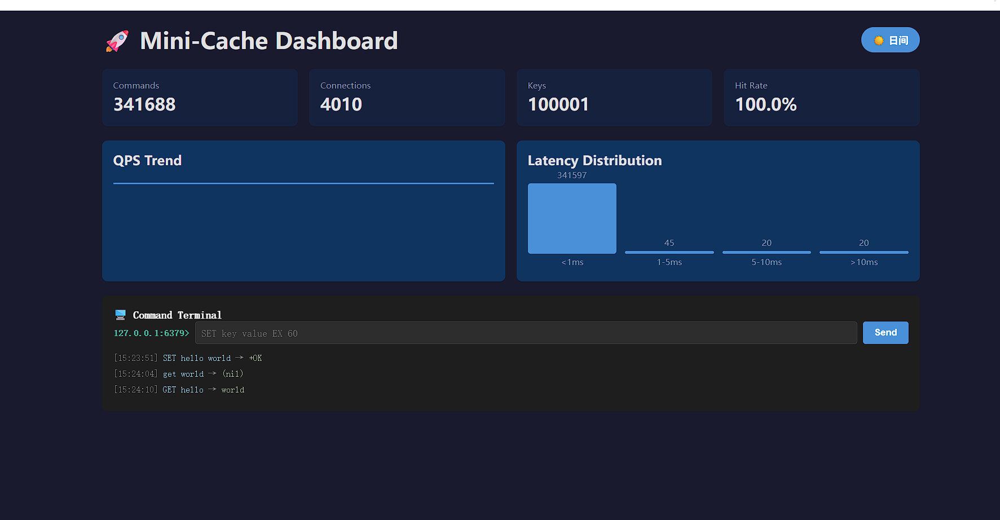

# Mini-Cache

> 基于 Rust + Tokio 的高性能内存缓存服务器，支持类 Redis 协议，附带实时监控面板。


---

## 项目定位

一个月可完成的 Rust 全栈项目，展示：

- **Rust 系统编程**：Ownership、Lifetime、并发、Async/Await
- **网络编程**：TCP 协议解析、Socket 编程、高并发连接处理
- **架构设计**：缓存淘汰策略、压力测试、水平扩展思路
- **全栈交付**：前端实时监控界面（Vite + React + TypeScript）

**目标岗位**：后端系统研发 / 量化基础设施

---

## 界面预览



> 实时监控面板：统计卡片、QPS 曲线、延迟分布、命令行终端（支持日间/夜间模式切换）

---

## 架构概览

```text
┌─────────────────────────────────────────┐
│  前端监控层 (Vite + React)               │
│  - 实时监控面板 (Dashboard)              │
│  - 命令行模拟器 (Terminal)               │
│  - HTTP 轮询获取统计数据                 │
└──────────────┬──────────────────────────┘
               │ HTTP (CORS)
┌──────────────▼──────────────────────────┐
│  HTTP API 层 (Axum)                      │
│  - GET  /api/stats    → JSON 统计       │
│  - POST /api/execute → 代理执行命令     │
└──────────────┬──────────────────────────┘
               │
┌──────────────▼──────────────────────────┐
│  TCP 接入层 (Tokio)                      │
│  - 监听端口 6379                         │
│  - 每连接一个 Task (tokio::spawn)       │
│  - 类 Redis 文本协议解析                 │
└──────────────┬──────────────────────────┘
               │
┌──────────────▼──────────────────────────┐
│  存储层 (RwLockStore)                    │
│  - RwLock<HashMap> 并发读写              │
│  - TTL 惰性删除 + 定期扫描               │
│  - Store trait 抽象接口                   │
└──────────────┬──────────────────────────┘
               │
┌──────────────▼──────────────────────────┐
│  统计层 (Stats)                          │
│  - AtomicU64 无锁计数器                  │
│  - 延迟分布直方图                        │
└─────────────────────────────────────────┘
```

---

## 快速启动

### 后端（Rust）

```bash
# 克隆仓库
git clone https://github.com/saltnuclear/minicache-rs.git
cd minicache-rs

# 启动服务（TCP 6379 + HTTP 8080）
cargo run --bin mini-cache
```

### 前端（Vite + React）

```bash
cd frontend
npm install
npm run dev
# 浏览器打开 http://localhost:3000
```

### Docker 一键启动

```bash
docker build -t minicache .
docker run -p 6379:6379 -p 8080:8080 minicache
```

---

## 支持的协议

| 命令 | 格式 | 说明 |
|------|------|------|
| SET | `SET key value [EX ttl]` | 设置键值，可选 TTL（秒） |
| GET | `GET key` | 获取键值 |
| DEL | `DEL key` | 删除键 |
| STATS | `STATS` | 返回统计信息 |

---

## 性能指标

| 指标 | 目标 | 实测（优化前）| 实测（优化后）| 状态 |
|------|------|-------------|-------------|------|
| QPS (SET) | > 50k | 47,351 | **77,901** | ✅ 达标 |
| QPS (GET) | > 50k | 60,846 | **92,211** | ✅ 达标 |
| P50 延迟 | < 1ms | 1.36ms / 0.01ms | **0.58ms / 0.00ms** | ✅ 达标 |
| P99 延迟 | < 5ms | 6.54ms / 67.26ms | **3.04ms / 7.06ms** | ✅ 接近达标 |
| 并发连接 | 1000+ | 1000 | 1000 | ✅ 达标 |

> **Week 4 优化**：将 `RwLock<HashMap>` 替换为 `DashMap`，SET QPS 提升 66%，P99 降低 70%。

详见 [BENCHMARK_LATEST.md](./BENCHMARK_LATEST.md)

---

## 项目结构

```
mini-cache/
├── Cargo.toml
├── README.md                  # 项目介绍
├── ARCHITECTURE.md            # 架构设计文档
├── BENCHMARK.md               # 压测报告
├── Dockerfile                 # 容器化部署
├── src/
│   ├── main.rs                # 入口：启动 TCP + HTTP
│   ├── api.rs                 # HTTP API (Axum)
│   ├── server.rs              # TCP 服务器 (Tokio)
│   ├── protocol.rs            # 协议解析
│   ├── store.rs               # 存储引擎 (Store trait + RwLockStore)
│   └── stats.rs               # 性能统计
├── examples/
│   └── bench_client.rs        # 自定义压测客户端
└── frontend/
    ├── package.json
    ├── vite.config.ts
    ├── index.html
    └── src/
        ├── main.tsx
        ├── App.tsx
        └── components/
            ├── Dashboard.tsx    # 监控面板
            └── Terminal.tsx     # 命令行
```

---

## 测试

### 编译与单元测试

```bash
# 编译（Debug 模式）
cargo build

# 编译（Release 优化模式，推荐压测使用）
cargo build --release

# 运行全部单元测试（27 个测试）
cargo test
```

### 压力测试

```bash
# 1. 编译压测客户端
cargo build --release --example bench_client

# 2. 启动服务端（保持运行）
cargo run --release --bin mini-cache

# 3. 另开终端，运行压测（SET 写入）
./target/release/examples/bench_client --host 127.0.0.1 --port 6379 --clients 1000 --requests 100000 --cmd set

# 4. GET 读取压测
./target/release/examples/bench_client --host 127.0.0.1 --port 6379 --clients 1000 --requests 100000 --cmd get

# 5. 混合压测（80% GET + 20% SET）
./target/release/examples/bench_client --host 127.0.0.1 --port 6379 --clients 1000 --requests 100000 --cmd mixed
```

### 前端监控面板

```bash
# 启动服务端（终端 1）
cargo run --release --bin mini-cache

# 启动前端（终端 2）
cd frontend
npm install
npm run dev

# 浏览器打开 http://localhost:3000
# 可以看到实时 QPS 曲线、延迟分布、统计卡片
```

### Docker 一键部署

```bash
# 构建镜像
docker build -t minicache .

# 运行容器（映射 6379 和 8080 端口）
docker run -d --name minicache -p 6379:6379 -p 8080:8080 minicache

# 查看日志
docker logs -f minicache

# 停止容器
docker stop minicache
```

---

## 文档

- [ARCHITECTURE.md](./ARCHITECTURE.md) — 架构设计、SOLID 原则、并发模型
- [BENCHMARK.md](./BENCHMARK.md) — 原始压测报告（v0.3.0 基准）
- [BENCHMARK_LATEST.md](./BENCHMARK_LATEST.md) — 最新压测记录（含 DashMap 优化对比）

---

## 许可协议

MIT
